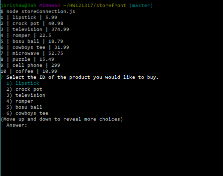
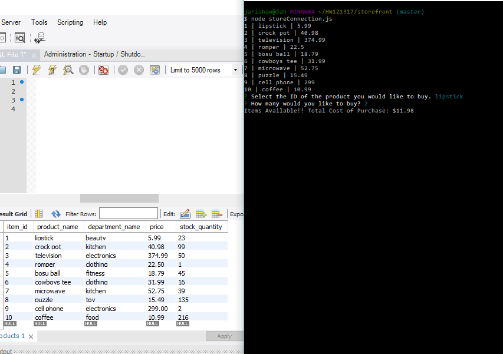
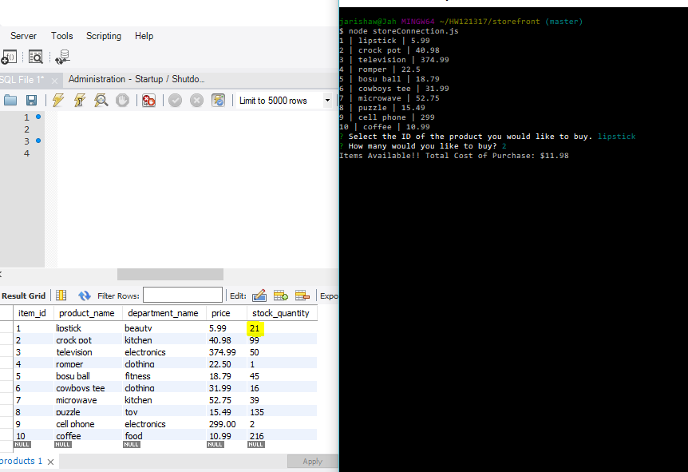
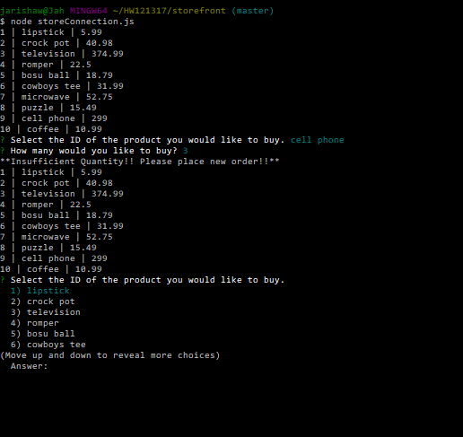

# storefront

1. Application will first display all of the items available for sale. Includes ids, names, and prices of products for 
sale.

2. Prompts user to select ID of product they want to buy and the quantity they want to buy. If sufficient quantity is
available, will display total cost.

3. Database updates stock quantity.

4. If not enough available, displays "Insufficient Quantity" and displays table again for new purchase.

